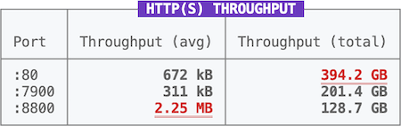

# Pretty Log

Pretty log message style API: color, format, and cursor.



``` js
prettyLog.BOLD.fg.WHITE.bg.color(128, 128, 255)(
  ` ${prettyLog.UNDERLINE("Example")} `
)
```

``` cli
npm install t-ski/pretty-log
```

## Synopsis

Pretty Log has a simple API: Provide an arbitrary chain of style expressions that are finally applied to a target string.

``` ts
import prettyLog from "t-ski/pretty-log";

prettyLog.[<style-expression>]+(targetString: string): string;
```

> Pretty log styled strings are nestable, i.e. can be embedded within styled strings themselves.

## Style Expressions

### Color

``` ts
prettyLog.<fg|bg>.<Color>
// OR
prettyLog.<fg|bg>.color(r: number, g: number, b: number)
prettyLog.<fg|bg>.color(hex: string)
```

Color styles must be prepended by a color channel. `fg` indicates the foreground color channel, whereas `bg` is for the complementary background color channel.

| `<Color>` | RGB |
| :- | -: |
| `BLACK` | `0, 0, 0` |
| `GRAY` | `128, 128, 128` |
| `WHITE` | `255, 255, 255` |
| `RED` | `255, 0, 0` |
| `ORANGE` | `255, 128, 0` |
| `YELLOW` | `255, 255, 0` |
| `LIME` | `0, 255, 0` |
| `GREEN` | `0, 255, 128` |
| `CYAN` | `0, 255, 255` |
| `BLUE` | `0, 0, 255` |
| `PURPLE` | `128, 0, 255` |
| `PINK` | `255, 0, 255` |

#### Example

``` js
prettyLog.bg.RED.fg.color(245, 245, 245)("Example");
```

### Format

``` ts
prettyLog.<Format>
```

| `<Format>` | Description |
| :- | :- |
| `BOLD` | Bold, i.e. higher intensity |
| `FAINT` | Faint, i.e. lower intensity |
| `ITALIC` | Italic |
| `UNDERLINE` | Underlined |
| `DOUBLY_UNDERLINE` | Doubly underlined |
| `BLINK` | Blink effect |
| `INVERT` | Invert coloring (`fg` ⇄ `bg`) |
| `STRIKE` | Strike through, i.e. crossed out |

> Whether and how styles are displayed depends on the console application.

#### Example

``` js
prettyLog.BOLD.UNDERLINE("Example");
```

### Cursor

``` ts
prettyLog.<Cursor>
// OR
prettyLog.cursor(x: number, y: number)
```

| `<Cursor>` | Description |
| :- | :- |
| `UP` | Up one line (row) (same as `.cursor(0, 1)`) |
| `DOWN` | Down one line (same as `.cursor(0, -1)`) |
| `LEFT` | Left one space (column) (same as `.cursor(-1, 0)`) |
| `RIGHT` | Right one space (same as `.cursor(1, 0)`) |
| `CLEAR` | Clear current line |
| `ERASE` | Clear the last completed line (`\n`) |
| `STORE` | Store the current cursor position |
| `RESTORE` | Restore the current cursor position |

#### Example

``` js
prettyLog.CLEAR(".".repeat((++iteration % 3) + 1));
```

## Macros

Assigning frequently used style chains to reusable macro variables might be helpful:

``` js
const CODE = prettyLog.BOLD.fg.ORANGE;
console.log(CODE(".method()"));

function badge(message) {
  console.log(
    prettyLog.BOLD.fg.WHITE.bg.color(128, 128, 255)(
      ` ${prettyLog.UNDERLINE(message.toUpperCase())} `
    )
  );
}
badge("Results");
```

##

<sub>&copy; Thassilo Martin Schiepanski</sub>